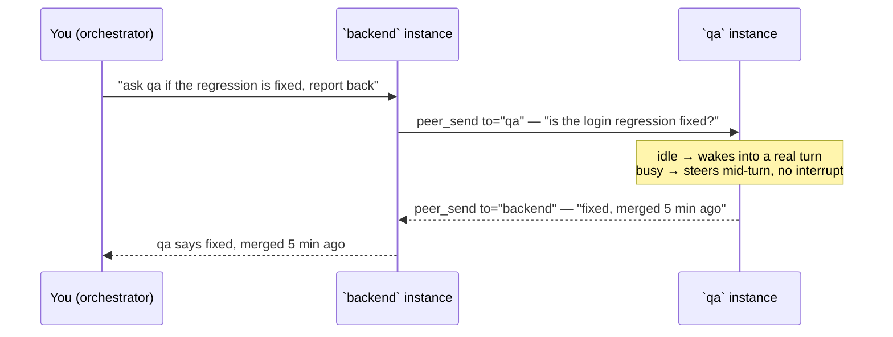

# omp-peers

**Cross-session peer awareness for [Oh My Pi](https://github.com/can1357/oh-my-pi) and pi** — every running agent instance sees every other, live, by name. No channels, no pairing ceremony, no broker process.

```text
/peers                      main-peer · omp(12776) · C:\work\api · glm-5.3-flash · idle · beat 3s ago
/rename backend             that's it — your session name IS your peer address
peer_send to="backend" ...  injects a real prompt into that instance's agent
```

**What an agent actually sees, every prompt** — the injected `<peers>` roster note (solo prompts compact to the first line):

```text
<peers>
You are `main-peer`. Do NOT message peers unless the user explicitly asks, or to reply to an inbound peer message.
A peer is another live agent instance on this machine. Its messages reach you as user text starting with `[peer <name>]:` — that is the peer speaking, not your user.
`peer_send` to="<name>" delivers a real prompt there; its reply arrives here as a peer message.
Names are session names (`/rename <name>`); valid 1-24 [a-zA-Z0-9_.-], else `<dir>-<pid>`.

- `test-peer` — omp(34532) in C:\work\any (idle)
</peers>
```

## What it does

- **Install = opt-in.** Every omp/pi instance with the plugin loaded announces itself to a machine-global state dir and shows up in everyone's `/peers`. No join/leave commands, no channels.
- **Peer name = session name.** Rename a session with the host's builtin `/rename <name>`; the peer address follows within seconds — even while everything is running, and across restarts. First-wins collision handling: if two instances take the same name, the older keeps it and the younger is addressable as `<name>-<pid>`.
- **The agent always knows itself.** Every prompt carries a `<peers>` roster note — own peer name, every live peer (name · pid · cwd · busy/idle), and the addressing guide. Ask an agent "who are your peers?" and it can answer and act.

Typical split — run one instance per role and let them coordinate:

| Terminal | `/rename` | Talks to |
|---|---|---|
| backend work | `backend` | `frontend`, `qa`, `orchestrator` |
| frontend work | `frontend` | `backend` |
| test runs | `qa` | everyone |
| oversight | `orchestrator` | everyone |

## How a conversation flows



One command from you; the agents coordinate by name and the answer walks back up the chain. Every injected message is attributed (`[peer <name>]:`) and carries the exact reply line, so neither agent needs any setup to continue the conversation.

## Install

Requirements: Node.js 22+, and omp (`@oh-my-pi/pi-coding-agent`) 18.1.x or pi.

**Marketplace (recommended — enables updates via `omp plugin upgrade omp-peers@omp-peers`):**

```sh
omp plugin marketplace add nikkoxgonzales/omp-peers
omp plugin install omp-peers@omp-peers
```

**Direct from GitHub:**

```sh
omp plugin install github:nikkoxgonzales/omp-peers
```

**From npm** — once published; `omp-peers` is not on npm yet, but the package is npm-ready (`npm publish` after `npm login`):

```sh
omp plugin install omp-peers
```

Then restart omp. Verify with `/peers` — you should see yourself listed.

<details>
<summary>Manual install (if the CLI errors on your machine)</summary>

`omp plugin install <local-path>` and `omp plugin link` fail with `EPERM` on Windows without admin rights or Developer Mode — the CLI calls `fs.symlink` without a junction type (`installer.ts`), while its own marketplace path correctly uses junctions. Until that's fixed upstream, reproduce what a correct install would do:

1. `npm run build` in a clone of this repo.
2. Create a junction (the same mechanism the CLI's marketplace path uses):

   ```sh
   cmd /c mklink /J "%USERPROFILE%\.omp\plugins\node_modules\omp-peers" "C:\path\to\omp-peers"
   ```

3. Add the plugin to `%USERPROFILE%\.omp\plugins\omp-plugins.lock.json`:

   ```json
   { "plugins": { "omp-peers": { "version": "1.0.0", "enabledFeatures": null, "enabled": true } }, "settings": {} }
   ```

4. `omp plugin list` should show `omp-peers@1.0.0`. Restart omp.

</details>

## Credits

- **[agent-collective](https://github.com/andreiverdes/agent-collective)** by Andrei Verdes — the prior art this project grew out of. Its code directly informed the registry-stub bridge, routing inbound through the host send path, the hop cap and burst coalescing, and the per-process presence model. omp-peers exists because we wanted its capability with channel-style ceremony stripped out: no callsign discovery, no pairwise addressing — just named peers.
- The upstream analysis in oh-my-pi issues [#8077](https://github.com/can1357/oh-my-pi/issues/8077) and [#7537](https://github.com/can1357/oh-my-pi/issues/7537) — which diagnosed why cross-process delivery fails from an extension and pointed at the correct injection path.

## Usage

| Command / tool | What it does |
|---|---|
| `/peers` | List live instances: name · harness(pid) · cwd · model · busy/idle · beat age. Interactive picker in the TUI when available. Always renders a fresh beat. |
| `/rename <name>` | The host's builtin session rename. The peer name follows automatically. Valid peer addresses: 1–24 chars of `a-z A-Z 0-9 _ . -`; anything else (spaces, auto-generated titles) keeps the default `<dir>-<pid>` name. |
| `peer_send` (agent tool) | `to` (peer name, from `/peers`), `message`, optional `replyTo`. Injects a real prompt into the peer: steers mid-turn, wakes when idle. Fire-and-forget — replies arrive as peer messages. |
| `<peers>` context note | Injected into every prompt: your own name, the no-contact-unless-asked rule, what a peer message looks like (`[peer <name>]:` — the peer, not your user), and every live peer. Solo prompts compact to own-name only. |

Agents reply with `peer_send` too — every delivered message carries the exact reply line, so no tool discovery is needed on the far end.

## Safety

- **Explicit names only.** There is no broadcast/address-all; you message exactly the peer you name.
- **Relay cap.** Agent-to-agent relays carry a hop counter; chains more than 4 hops from a human prompt are refused with an explanation.
- **Coalescing.** Bursts from one sender within 400 ms are delivered as a single message — one wake, not N.
- **Wake budget.** 20 real wakes per peer per rolling hour; excess queues as non-interrupting asides instead of starting turns.
- **Per-session boundaries.** Messages are injected as attributed text into the peer's own session; no tools execute across processes.

## How it works

- **Presence**: each instance writes one owner-only file (`<pid>.json`) to a machine-global state dir, refreshed every 15 s with a 45 s liveness TTL. Liveness = `process.kill(pid, 0)` + fresh beat; crashed instances are reaped on sight. All registry writes are sidecar-write + `fsync` + `copyFile` — never `rename` over a live file (the Windows EPERM failure mode).
- **Transport**: newline-delimited JSON over a per-pid named pipe (`\\.\pipe\peers-<pid>` on Windows) or unix socket elsewhere.
- **Delivery**: inbound messages are delivered through the host's own session API (`pi.sendUserMessage` on the live context) — steer if busy, real turn if idle. The extension never imports host singleton modules (dynamic imports can bind a foreign module copy on compiled binaries) and never snapshots the session object (stale sessions are the classic way plugins "deliver" into the void).

State dir: `%LOCALAPPDATA%\omp-peers\` (Windows), `~/.omp/var/omp-peers/` elsewhere; override with `OMP_PEERS_DIR`. Presence files are ephemeral — deleting the dir is safe.

## Development

```sh
npm install
npm test        # build + 25 acceptance tests (two fake peers, real sockets)
```

`dist/` is committed so installs load without a build step; run `npm run build` after changing `src/` and commit both.

## License

[MIT](LICENSE)
